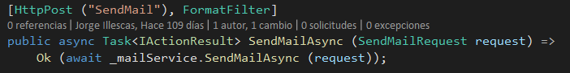
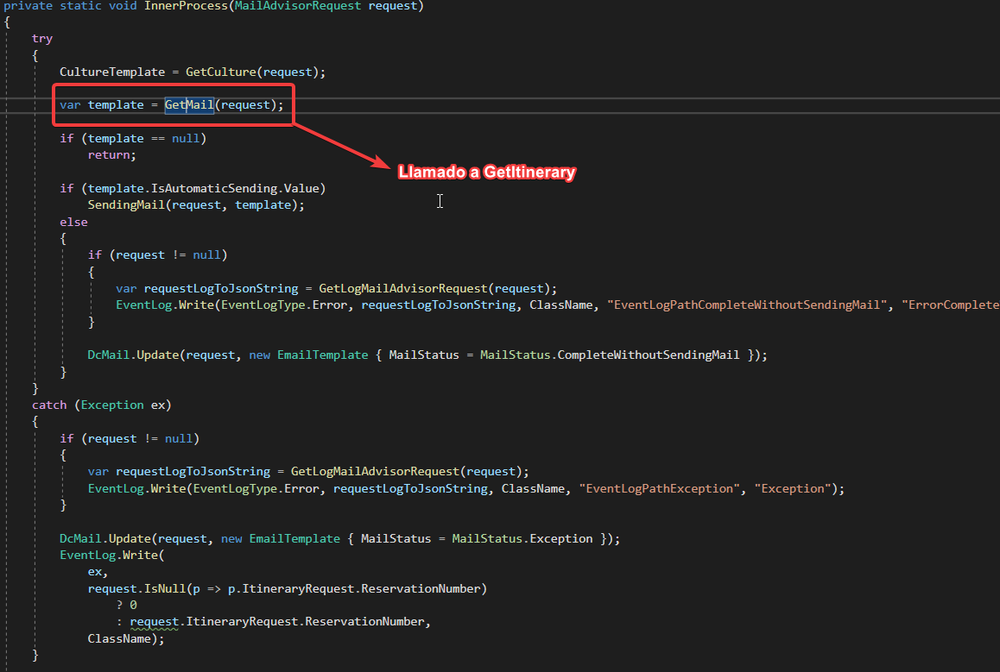
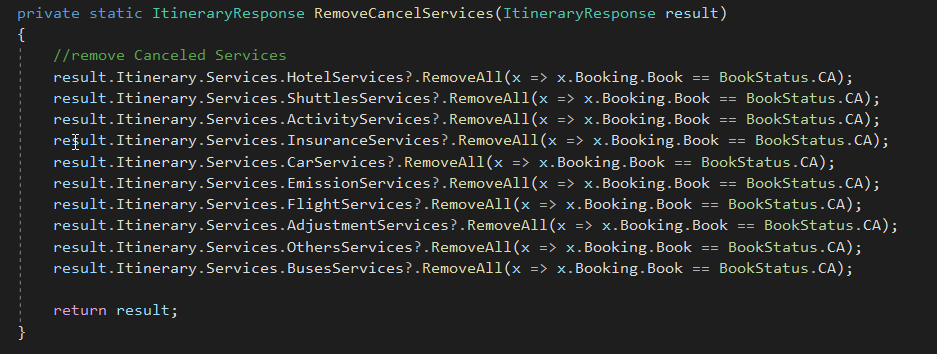

# **MailAdivisor**

## _MailAdivisor 2.0(FullFramework)_
>Api principal de MailAdvisor, es la que las aplicaciones usan ahorita, por dentro se cosume la api MailAdvisor Net Core.
>Estructura del proyecto
>>

>AddSendingMail - Metodo para enviar los mails
>>
>>* Se valida si esta activa la API migrada a Net Core
>>* En caso de estar activa la API, se le envia el request que se recibe.
>>* Si no esta activa si continua con el flujo antiguo(Full Framework)

~~~ 
Estructura del request:

 MailRequest = new
 {
    Availability = string.Empty,
    BookingStatus = "X",
    GrouperAffiliate = "BDANTI",
    Affiliate = string.Empty,
    StatusPayment = "N",
    PaymentType = "R",
    IsOnline = false,
    IsClient = false,
    IsFlight = false,
    CultureIso = "ES-MX",
    ReservationNumber = bookInfo.Id,
    Cco = "",
    Cc =  "",
    DataSource = new
    {
        Guest = new
        {
            FullName = bookInfo.Pax,
            bookInfo.Email
        },
        ReservationNumber = bookInfo.Id,
        Payments = bookInfo.Payments,
        Affiliate = new
        {
            bookInfo.Associate.Name,
            URL = bookInfo.Associate.Url
        },
        From = "",
        To = "",
    }
}
~~~

## _BestDay.MailAdvisor.Api_
>API Net Core, migracion de la API MailAdvisor Full Framework.  
>>Estructura:   

 >SendMailAsync (POST):
 >>
 >>* Se valida el request.
 >>* Se obtiene la plantilla del Mail.
 >>* Se valida la plantilla.
 >>* Se procesa la plantilla y se genera el correo.
 >>* Se valida la bandera de envio (Si el correo se debe enviar automaticamente).
 >>* Se valida si el template puede enviarse.
 >>* Se envia el correo electronico.
 
>El flujo completo de SendMail no hace uso de GetItinerary, pero tanto la API Full Framework y la API Net Core hacen uso de GetItinerary en MailController y MailItineraryController.

# Llamados a GetItinerary

## _MailAdvisor 2.0 (FullFramework)_

### _MailAdvisorController_
- Muy parecido a MailController, solo incluye algunas validaciones extras

~~~
Metodo Get del controller MailAdvisor recibe  un request de tipo string ---> MailAdvisorRequest 
~~~
>
>>
>>>

~~~
Metodo AddGet del controller MailAdvisor recibe  un request de tipo string ---> MailAdvisorRequest 
~~~

>
>>
>>>
>>>>
>>>>>
### _MailItineraryController_

- Obtiene el HTML para el correo

~~~
Todos los métodos en el controller implementan el método ProcessMailContent de la clase ItinerarySendResponse
~~~
>
>>

~~~
Al momento de obtener el Itinerary todos los servicios cancelados se eliminan
~~~

>>
>>>

## _BestDay MailAdvisor (NetCore)_

### _MailAdvisorController_

~~~
Controlador que se encarga de enviar correos electrónicos mediante la bitácora de MailAdvisor, no hace uso de GetItinerary
~~~

>
>

### _MailItineraryController_

~~~
Controlador que se encarga de procesar templates de correo electronico, los dos metodos implementan GetMailContentAsync
~~~

>
>

~~~
GetMailContentAsync -> Procesa el contenido de un template de correo electronico y retorna un template procesado que incluye el origen de datos en su estructura HTML

Flujo:
- Valida si la operacion es una transacción en cadena
- Se valida para descartar correos de canales mayoristas con asociado agrupador
  bestday
- Se modifican los valores obtenidos por el itinerario
- Se obtiene el datasource para el template
- Se obtiene la plantilla
- Se valida la plantilla
- Se settea el idioma para traducción de fechas del itinerario
- Se procesa la plantilla y se genera el correo
~~~

>
>>